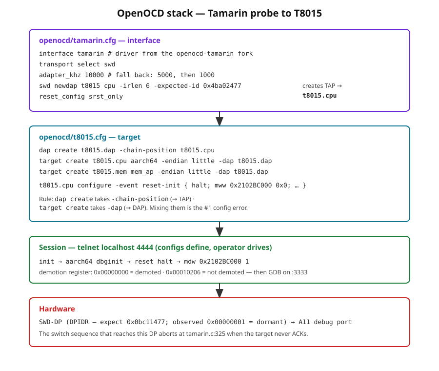
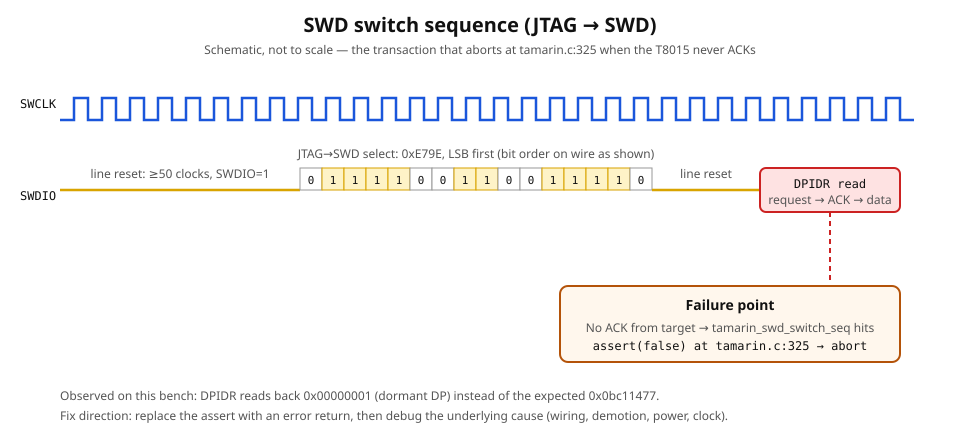
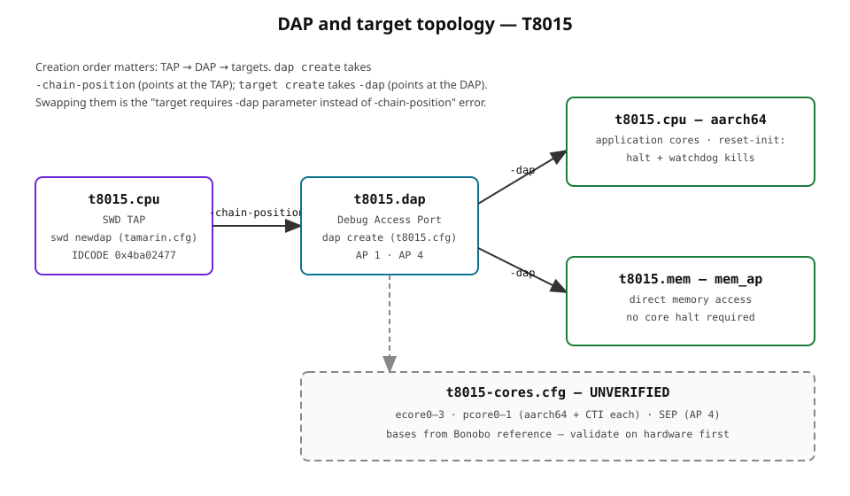

# Tamarin — Pico SWD Debug Probe for iPhone X (A11/T8015)

Bring-up of a Raspberry Pi Pico as an SWD debug probe for the Apple A11
(T8015) in a jailbroken, demoted iPhone X, using a custom OpenOCD fork
and hand-written interface/target configurations.

## Status

Bring-up is ~90% complete. The full toolchain builds, the probe enumerates,
and OpenOCD reaches the SWD DP on the target (`Info: SWD DPIDR 0x00000001`
at 10 MHz). No stable, sustained halt/read-memory session is on record —
the last observed failure is a low-level SWD switch-sequence abort in the
Tamarin driver (`tamarin.c:325`), i.e. a probe↔target signaling problem,
not a config problem. See REVIEW.md.

## Hardware bench

| Role | Hardware |
|---|---|
| Target | iPhone X, A11 (T8015, CPID:8015), iOS 15.5, palera1n jailbreak + `--demote` |
| Probe | Raspberry Pi Pico (RP2040); Pico 2W (RP2350) as alternate |
| Cable | HAM DCSD ALEX cable (FTDI 0403:6001, later 6010) — enumerated, then bypassed |
| Host | Intel MacBook Air, macOS 15 |
| Spares | Pi Zero 2W; Glasgow Digital Interface Explorer (evaluated, not used) |

## Software

- **OpenOCD**: `stacksmashing/openocd-tamarin` fork (provides the `tamarin`
  adapter driver and `tamarin.c`). Mainline OpenOCD cannot drive this probe.
- **Probe firmware**: `stacksmashing/tamarin-firmware` on the Pico.
- **Reference**: Bonobo SWD configs (docs.bonoboswd.com) — used as the
  source for core/CTI base addresses in `t8015-cores.cfg` (unverified).

## Key identifiers

| Item | Value | Notes |
|---|---|---|
| TAP IDCODE (`-expected-id`) | `0x4ba02477` | Converged during bring-up |
| Expected SWD DPIDR | `0x0bc11477` | Never observed on the wire; aspirational |
| Observed DPIDR | `0x00000001` | Dormant/unresponsive DP — the open problem |
| Demotion register | `0x2102BC000` | `mdw` → `0x00000000` = demoted, `0x00010206` = not demoted |
| Watchdog kill, E-core 0 | `mww 0x2102BC000 0x0` | |
| Watchdog kill, E-core 1 | `mww 0x2102BD000 0x0` | |

## Timeline

- **2025-03-27 → 2025-04-18**: core bring-up sprint — jailbreak/demote,
  probe wiring, OpenOCD config iteration, error elimination.
- **2025-05 → 2025-07**: follow-ons — SEP questions, Black Magic Probe on
  A12, Astris tooling, Kong probe research.
- **2025-11, 2026-04, 2026-06**: occasional returns (binary analysis,
  TG1682 cross-over).

## Files

```
openocd/tamarin.cfg       Interface: tamarin driver, SWD, 10 MHz, TAP creation
openocd/t8015.cfg         Target: DAP, A11 CPU + MEM-AP, watchdog-kill reset-init
openocd/t8015-cores.cfg   UNVERIFIED full config: E/P cores, CTI, SEP (Bonobo-derived)
docs/setup.md             Step-by-step bring-up procedure
docs/troubleshooting.md   Every error hit during bring-up, and the fix
docs/glossary.md          SWD / DAP / OpenOCD terminology used in this project
docs/images/              Diagrams (SVG, editable)
REVIEW.md                 Technical review: corrections, flags, open questions
```

## Diagrams


*Probe/host/iPhone wiring — the iPhone-side pinout is UNVERIFIED.*


*Config → TAP → DAP → target creation order.*


*End-to-end bring-up with decision points.*


*The JTAG→SWD transaction that aborts at `tamarin.c:325`.*


*TAP → DAP → target relationships and the `-chain-position`/`-dap` rule.*

## Quick start

```sh
# Terminal 1 — start OpenOCD
openocd -f openocd/tamarin.cfg -f openocd/t8015.cfg

# Terminal 2 — drive the session
telnet localhost 4444
> init
> aarch64 dbginit
> reset halt
> mdw 0x2102BC000 1
```

Full procedure: `docs/setup.md`. When something breaks: `docs/troubleshooting.md`.
