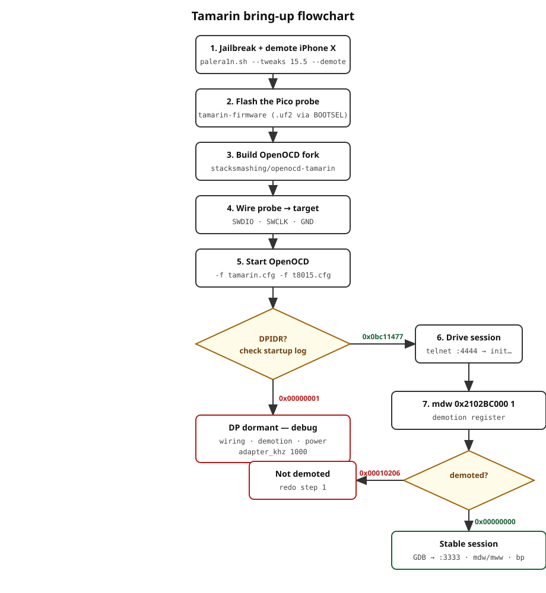
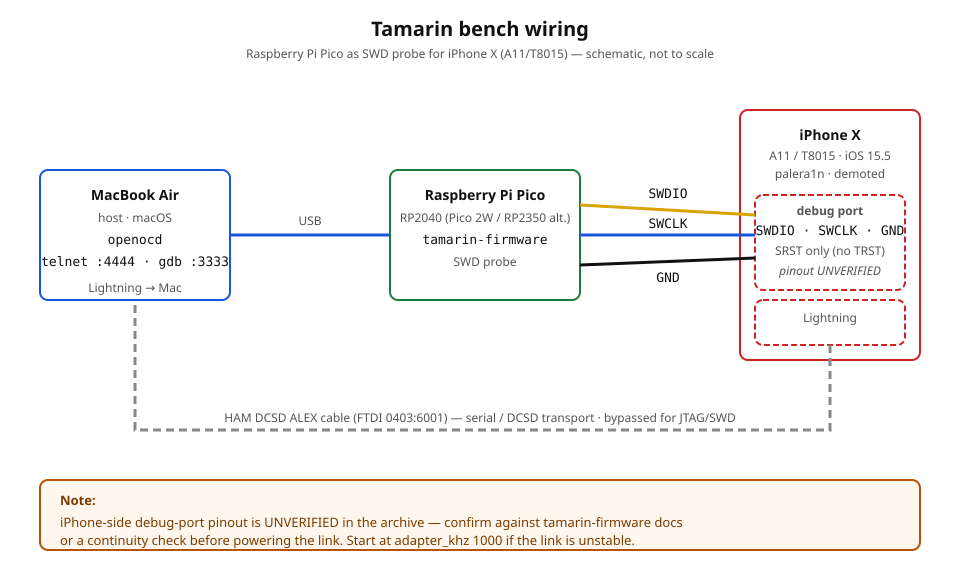

# Tamarin bring-up procedure

End-to-end steps assembled from the bring-up threads. Assumes the hardware
bench in the README. Stop at the first step that fails and consult
`troubleshooting.md`.




## 1. Prepare the iPhone X

1. Put the iPhone X (iOS 15.5) into DFU mode and connect it to the Mac
   via the DCSD ALEX cable.
2. Jailbreak and demote with palera1n (demotion is irreversible — it
   permanently disables the Secure Enclave):
   ```sh
   sudo ./palera1n.sh --tweaks 15.5 --demote
   ```
3. Confirm the phone boots jailbroken. Demotion itself is verified later
   from OpenOCD (`mdw 0x2102BC000 1` → `0x00000000`).

## 2. Prepare the Pico probe

1. Flash the Pico with `stacksmashing/tamarin-firmware` (hold BOOTSEL,
   drop the `.uf2` onto the mass-storage device).
2. Verify it enumerates:
   ```sh
   system_profiler SPUSBDataType | grep -A5 -i tamarin
   ```
   Expect the Tamarin control serial port (used for DCSD/JTAG mode
   config) plus the DCSD serial port.

Alternative path: flash `picoprobe.uf2` instead and use
`interface/cmsis-dap.cfg` with `-c "cmsis-dap vid_pid 0x2e8a 0x000c"`.
Wiring for picoprobe: probe **GPIO2 → SWDIO**, **GPIO3 → SWCLK**,
**GND → GND** on the target Pico.

## 3. Build the OpenOCD fork

Mainline OpenOCD has no `tamarin` driver. Build the fork:

```sh
git clone https://github.com/stacksmashing/openocd-tamarin
cd openocd-tamarin
./bootstrap
./configure --enable-maintainer-mode
make -j$(sysctl -n hw.ncpu)
sudo make install
```

If `interface/*.cfg` files are missing afterwards, the install step was
incomplete — rerun `sudo make install` and verify
`.../tcl/interface` is populated.

## 4. Wire probe to target

Connect the Tamarin probe to the iPhone X debug port: **SWDIO**,
**SWCLK**, **GND**. (Pinout: verify against the tamarin-firmware
documentation for your cable revision — the archive does not contain a
definitive pinout; see REVIEW.md.)

Keep the initial adapter clock conservative if the link is flaky:
drop `adapter_khz` in `tamarin.cfg` from 10000 to 5000, then 1000.

## 5. Start OpenOCD

Terminal 1:
```sh
openocd -f openocd/tamarin.cfg -f openocd/t8015.cfg
```

Healthy startup looks like:
```
Info : only one transport option; autoselect 'swd'
Info : clock speed 10000 kHz
Info : SWD DPIDR 0x0bc11477
```

`SWD DPIDR 0x00000001` means the DP is not really answering — check
wiring, demotion state, and target power before anything else.

## 6. Drive the debug session

Terminal 2:
```sh
telnet localhost 4444
```

```
> init
> aarch64 dbginit
> reset halt
> mdw 0x2102BC000 1
```

- `0x2102bc000: 00000000` → phone is demoted. Proceed.
- `0x2102bc000: 00010206` → not demoted. Debug will not work; redo step 1.

For GDB:
```
> gdb_port 3333
```
then `target extended-remote :3333` from GDB. If GDB drops with
"Core.0 failed to shut down", the `reset-init` watchdog kills in
`t8015.cfg` are not firing — see troubleshooting.

## 7. Go further (only after step 6 is stable)

- Swap in `openocd/t8015-cores.cfg` for per-core targets and the SEP.
  Validate each core's `dbgbase`/`ctibase` individually before trusting it.
- Useful telnet commands: `mdw`/`mww` (memory), `reg`, `halt`, `resume`,
  `step`, `bp <addr> 4 hw`.
